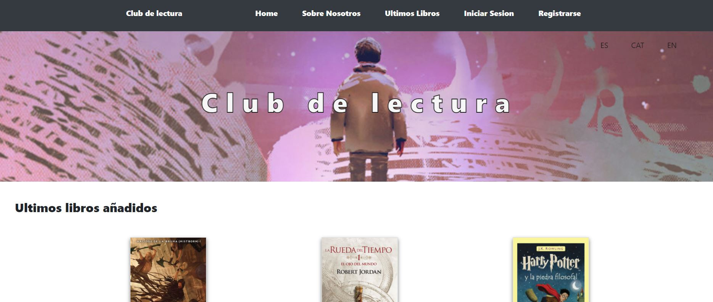
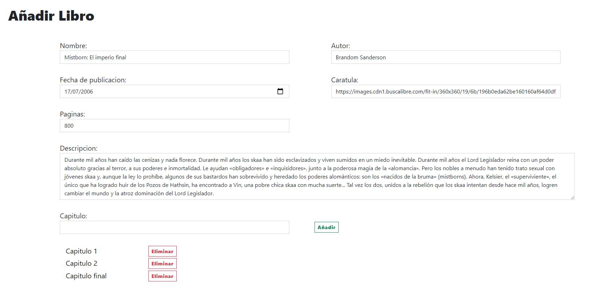
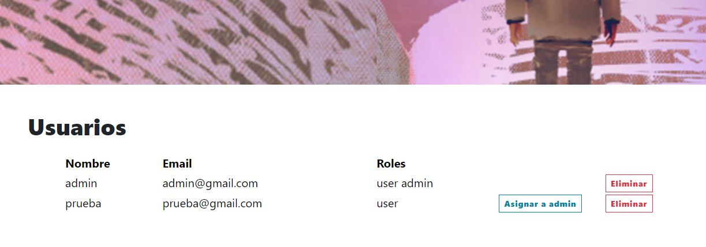
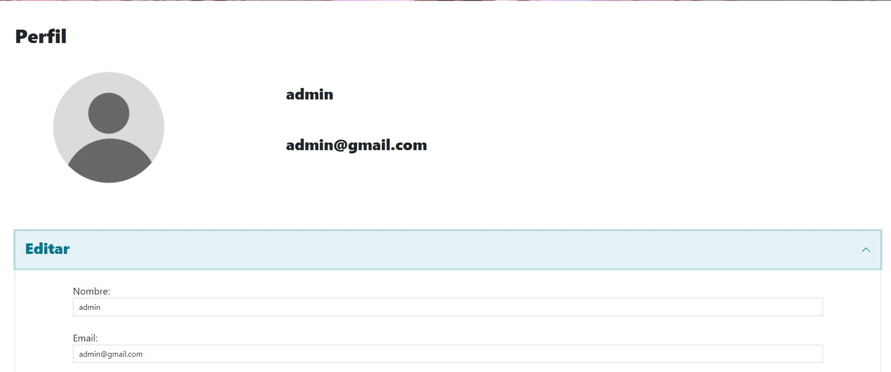
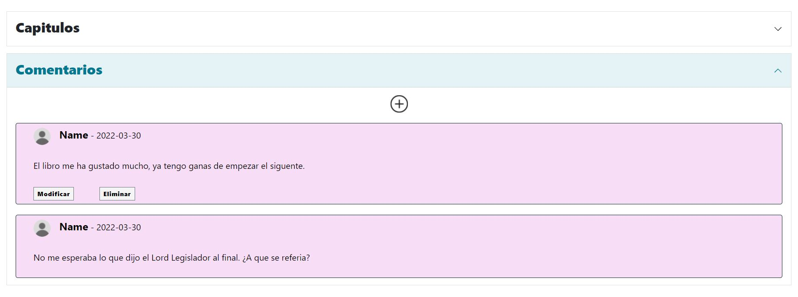

# Frontend Foro de libros

Este es un proyecto personal, trata de crear un backend y frontend para crear un foro de libros. En él los usuarios podran poner los comentarios de sus partes favoritas de los libros y capitulos de estos que mas les gusten.

Repositorio Backend:
https://github.com/Rafael3994/Backend_Foro_Libros

## Deploy de la aplicacion 🚀

Frontend URL: https://frontend-foro-libros.herokuapp.com

### Instalación en local 🔧

- Clona el repositorio en tu maquina local

```
git clone https://github.com/Rafael3994/Frontend_Foro_Libros.git
```

- Instalamos node.js en el ordenador, con ello tambien abremos instalado npm.
- Abrimos el repositiorio clonado con un IDE e instalamos las librerias.

```
## npm
npm install

## yarn
yarn install
```

- Para utilizarlo en tu local ves al fichero que se encuentra en src/variablesGlobales.js y hay pon la ruta de tu backend local.

- Finalmente para iniciar el proyecto ejecuta el comando

```
## npm
npm start

## yarn
yarn start
```

## Uso de la aplicacion⚙️

La aplicacion se puede usar dependiendo el role que tenga el ususario, estos son admin o user.

- Pagina Home


En esta pagina el uso de los roles no afecta, se puede ver los tres ultimos libros, un apartado con una descripcion de lo que hace esta pagina, dos formularions para iniciar sesion y el otro para registrarte. En la esquina superior derecha del banner tiene el usuario la opcion de escoger el idioma de la pagina.
##
#####Paginas del Admin
- Pagina de administracion de libros

En la pagina hay un listado de todos los libros que hay en la pagina, donde se puede ver con detalle o eliminar un libro en concreto. Y tambien existe un boton que te envia a la pagina de creacion de un libro.
##
- Pagina crear libro

Hay un formulario donde se pondran los datos de dicho libro que se quiera crear.
##
- Pagina de administracion de usuarios

Se ve un listado con la informacion basica de cada usuario, se puede eliminar y asignar el role de admin a un usuario en concreto.
##
#####Paginas del User
- Pagina de administracion de usuarios

Esta pagina la tienen todos los usuarios, en ella se pueden ver la informacion del usuario con en el que sea iniciado sesion y puede modificar los datos o eliminar la cuenta.
##
- Pagina de administracion de usuarios

Esta pagina la tienen todos los usuarios, en ella se pueden ver la informacion del usuario con en el que sea iniciado sesion y puede modificar los datos o eliminar la cuenta.
##
- Pagina Libros

Se pueden ver todos los libros que hay, si de las click a uno de ellos te mandara a la vista detallada de este.
##
- Pagina Libro

En esta pagina se puede ver la informacion del libro. Y puedes poner comentarios al libro y en el capitulo que quieras.

El boton (+) es para añadir un comentario, y puedos modificar tus comentarios o eliminarlos

## Construido con 🛠️

- [JavaScript](https://www.javascript.com/) - Lenguaje de programacion
- [Node.js](https://nodejs.org/es/) - Entorno de ejecucion
- [React](https://reactjs.org/) - Framework de node para Frontend

Algunas librerias:

- [Axios](https://axios-http.com/) - Para hacer peticiones http
- [React-bootstrap](https://react-bootstrap.github.io/) - Poner componentes de bootstrap
- [sweetalert2](https://sweetalert2.github.io/) - Poner altertas
- [react-hot-toast](https://react-hot-toast.com/docs) - Para poner mensajes flotantes
- [react-redux](https://github.com/reduxjs/react-redux) - Para que la aplicacion tenga un estado global

## Autor ✒️

**Rafael Garcia Perez** - [rafael3994](https://github.com/Rafael3994)

## Licencia 📄

Este proyecto está bajo la Licencia.
